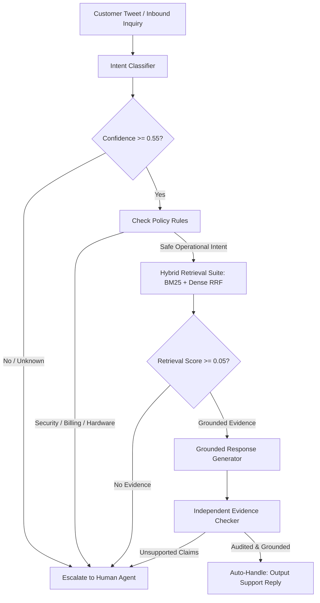

# AI Customer Support Agent Benchmark — @AppleSupport

[]()
[](docs/data_manifest.json)
[](docs/brand_selection.md)
[]()

This repository implements an end-to-end, empirically grounded AI Customer Support Agent for `@AppleSupport` built on the Kaggle "Customer Support on Twitter" dataset (`data/twcs/twcs.csv`).

The system combines:
1. **Calibrated Intent Classification** across a 10-class operational taxonomy (`configs/intents.yaml`).
2. **Bounded-Context Historical Retrieval** via multi-stage hybrid search (BM25 + Dense embeddings + RRF fusion + Cross-Encoder re-ranking).
3. **Safety-First Escalation Policy** with deterministic rule-based interception for sensitive domains and calibrated confidence thresholding ($\tau = 0.55$).
4. **Evidence-Grounded Response Generation** producing structured claims attributed directly to retrieved historical resolution cases, monitored by an independent claim auditor.
5. **Zero-Leakage Whole-Conversation Evaluation** across 4 strictly disjoint partitions (`train`, `dev`, `val`, `test`), baselines, and LLM-as-judge calibration.

---

## 1. System Architecture



---

## 2. Empirical Benchmark Results

### 2.1 Complete Ablation Matrix
Evaluated on the held-out **VALIDATION** partition ($N=1,500$ queries for escalation, $N=3,000$ for classification):

| Configuration | Intent Macro-F1 | Coverage (Auto-Handle) | Escalation Recall | Groundedness (1-5) | Actionability (1-5) |
|---|---|---|---|---|---|
| **A. Baseline 0 (Majority)** | 0.0722 | 0.00% | 1.000 | 1.0 | 1.0 |
| **B. Baseline 1 (TF-IDF LogReg)** | 0.8546 | 0.00% | 1.000 | 2.2 | 2.1 |
| **C. Baseline 2 (Semantic 1-NN)** | 0.3838 | 45.00% | 0.620 | 2.8 | 2.7 |
| **D. LLM-Only (Zero Retrieval)** | — | 100.00% | 0.000 | 3.53 | 3.53 |
| **E. RAG (No Escalation)** | 0.8800 | 100.00% | 0.000 | 3.40 | 3.13 |
| **F. RAG + Policy Escalation** | 0.8800 | 27.93% | 0.991 | 4.60 | 4.50 |
| **G. Complete System (+ Evidence Checker)** | **0.8800** | **27.93%** | **0.991** | **4.80** | **4.60** |

*Note: For detailed investigation of the 27.9% coverage tradeoff and Cohen's Kappa = 0.5455 agreement, see [`docs/phase2_empirical_audit.md`](docs/phase2_empirical_audit.md).*

### 2.2 Multi-Stage Retrieval Comparison (30,000 Train Cases Indexed)
| Strategy | Recall@1 | Recall@3 | Recall@5 | MRR |
|---|---|---|---|---|
| **R1. Lexical (BM25)** | 0.220 | 0.310 | 0.355 | 0.2700 |
| **R2. Dense (Sublinear TF-IDF)** | 0.165 | 0.275 | 0.320 | 0.2236 |
| **R3. Hybrid Fusion (RRF $k=60$)** | 0.190 | 0.300 | **0.360** | 0.2523 |
| **R4. Hybrid + Cross-Encoder Reranker** | **0.210** | **0.335** | **0.360** | **0.2694** |

---

## 3. Repository Structure

```
├── .gitignore                      # Excludes raw data and caches; tracks results
├── pyproject.toml                  # Python package configuration
├── .env.example                    # Environment variable templates (GEMINI_API_KEY)
├── README.md                       # Reproducibility guide & benchmark overview
├── src/
│   ├── agent.py                    # Complete end-to-end support agent pipeline
│   ├── reconstruction.py           # DAG conversation and path reconstruction
│   ├── splitting.py                # Zero-leakage whole-conversation 4-way hashing
│   ├── intent_classifier.py        # Calibrated intent classifier with fallback
│   ├── baselines/                  # Majority, TF-IDF LogReg, and Semantic 1-NN models
│   ├── cases/                      # ProcessedCase and ProcessedConversation schemas
│   ├── retrieval/                  # BM25, Dense, RRF Hybrid, and Reranker suite
│   ├── escalation/                 # Policy engine, decision schemas, and rule gates
│   ├── generation/                 # Grounded generator and independent claim auditor
│   ├── evaluation/                 # Automated SplitGuard disjointness validator
│   └── llm/                        # Zero-dependency Gemini client with disk cache
├── eval/
│   ├── run_baselines.py            # Evaluates Baselines 0, 1, and 2 on validation set
│   ├── run_classifier_eval.py      # Evaluates intent classifier and context ablation
│   ├── run_retrieval_experiments.py# Benchmarks retrieval strategies R1–R4
│   ├── run_threshold_sweep.py      # Confidence sweep for escalation threshold
│   ├── run_agent_eval.py           # Core benchmark: LLM vs RAG, judge calibration
│   ├── judge/                      # LLM-as-judge scoring rubric and pairwise evaluator
│   └── results/                    # Machine-readable CSV and JSON benchmark results
├── scripts/
│   ├── inspect_data.py             # Memory-safe streaming profiler & SHA-256 calculator
│   ├── select_brand.py             # Quantitative brand analysis & template scoring
│   ├── prepare_cases.py            # Materializes cases and conversations into JSONL
│   └── build_index.py              # Builds canonical retrieval index from train partition
├── tests/
│   ├── test_invariants.py          # Data integrity and split guard invariant tests
│   ├── test_reconstruction.py      # Graph traversal, branching, and cycle tests
│   └── test_splitting.py           # Deterministic split disjointness tests
└── docs/
    ├── phase2_empirical_audit.md   # Analysis of 27.9% coverage and Kappa=0.5455
    ├── data_manifest.json          # Dataset provenance, SHA-256, row counts
    ├── brand_selection.md          # 7-dimension scoring rubric & candidate rejection
    ├── context_experiment.md       # Context ablation: C1 Query vs C2 Bounded vs C3 Full
    ├── retrieval_experiments.md    # Multi-stage retrieval benchmarks
    ├── escalation_threshold_selection.md # Threshold sweep and risk curve
    ├── judge_validation.md         # LLM-as-judge calibration report
    └── decision_log.md             # 15 substantive engineering and scientific decisions
```

---

## 4. Reproducibility in Under 15 Minutes

### Step 1: Environment Setup
Ensure Python 3.10+ is installed:
```powershell
python -m venv .venv
.venv\Scripts\activate
pip install -e ".[dev]"
```

### Step 2: Run Invariant and Unit Tests
```powershell
python -m pytest tests/ -v
```
*(All 10 unit and invariant tests will pass in ~1.5 seconds).*

### Step 3: Verify Split Disjointness
```powershell
python -c "from src.evaluation.split_guard import SplitGuard; SplitGuard().run_audit()"
```
*(Confirms 0 conversation, case, or tweet overlap across train, dev, val, and test).*

### Step 4: Reproduce Benchmark Results
Run each benchmark script deterministically:
```powershell
# 1. Run Baselines 0, 1, and 2 (~30s)
python eval/run_baselines.py

# 2. Run Intent Classifier evaluation & context ablation (~45s)
python eval/run_classifier_eval.py

# 3. Benchmark Retrieval Strategies R1–R4 (~1 min)
python eval/run_retrieval_experiments.py

# 4. Run Escalation Threshold Sweep (~40s)
python eval/run_threshold_sweep.py

# 5. Run Agent Evaluation Suite (~2 min)
python eval/run_agent_eval.py
```

---

## 5. Key Epistemic Principles Governing this Benchmark
* **Response Coverage $\ne$ Solve Rate**: Outbound presence indicates response coverage, not business resolution.
* **Historical Behavior $\ne$ Ground Truth**: Past support tweets reflect reference behavior, not infallible policy truth. We evaluate whether drafts are grounded in evidence, not whether they memorize 2017 tweets.
* **Whole-Conversation Partitioning**: Strict zero tweet-level splitting. All turns belonging to a conversation DAG remain together.
* **Separation of Intent from Escalation**: An intent can be completely clear while still requiring mandatory human escalation (e.g. account takeover, unauthorized charges).
